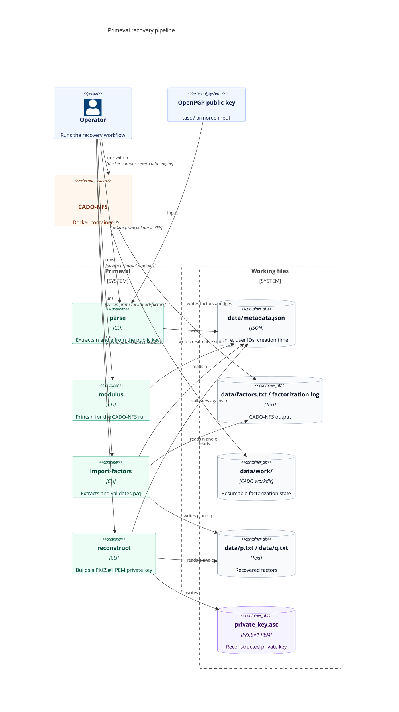

# Primeval

[](https://github.com/trygu/primeval/actions/workflows/ci.yml)

**Primeval** is a toolchain for the technical recovery of historical RSA keys (512-bit or shorter). The purpose is purely historical and aimed at digital archaeology: these key lengths are today considered cryptographically broken and are no longer in active use. The tool enables reconstruction of private keys that have been lost to history.

Recovered output should be handled like any other private key.

---

## Requirements

- Python 3.10–3.12 (`pgpy` is not yet compatible with 3.13+)
- [uv](https://docs.astral.sh/uv/) — `curl -LsSf https://astral.sh/uv/install.sh | sh`
- Docker + Docker Compose (for CADO-NFS)
- **Linux x86_64** for the factorization step — the CADO-NFS image uses AVX2/AVX-512 instructions and will crash with "Illegal instruction" under Rosetta 2 on Apple Silicon

## Setup

```bash
git clone <repo>
cd primeval
uv sync --extra dev
```

## Usage

All tools are available through the `primeval` CLI:

```bash
uv run primeval parse KEY [-o data/metadata.json]
uv run primeval modulus [-m data/metadata.json]
uv run primeval import-factors [data/factors.txt] [-m data/metadata.json] [-p data/p.txt] [-q data/q.txt]
uv run primeval reconstruct [-m data/metadata.json] [-p data/p.txt] [-q data/q.txt] [-o private_key.asc]
```

**Step 1 — Parse the public key:**

```bash
uv run primeval parse primeval/publickey.asc
```

Writes `data/metadata.json`.

**Step 2 — Start the CADO-NFS container:**

```bash
docker compose up --build -d
```

**Step 3 — Run factorization:**

```bash
N=$(uv run primeval modulus)
docker compose exec cado-engine bash -c \
  "cado-nfs.py $N --workdir /work/work \
   2> >(tee /work/factorization.log >&2) \
   | tee /work/factors.txt"
```

For 512-bit keys: minutes to hours on modern hardware. CADO-NFS can be interrupted and resumed — state is saved in `data/work/`.

**Step 4 — Store factors (`p`, `q`) directly:**

Where to find them:

- `data/factors.txt` (preferred): usually one line with two integers: `p q`
- `data/factorization.log` (fallback): look near the end; factors are typically printed as two large integers

```bash
uv run primeval import-factors
```

If `factors.txt` is unavailable, use the log:

```bash
uv run primeval import-factors data/factorization.log
```

Writes `data/p.txt` and `data/q.txt`. The command validates the pair against
`data/metadata.json` when metadata is available.

**Step 5 — Reconstruct the private key:**

```bash
uv run primeval reconstruct
chmod 600 private_key.asc
```

Writes `private_key.asc` in the working directory. Despite the `.asc` suffix,
this file is a PEM-encoded RSA private key, not an OpenPGP secret-key packet.

---

## Background and motivation

Modern cryptography libraries refuse to import RSA keys shorter than 1024-bit and do not support legacy PGP packet formats (v2/v3). Reconstructing a historical private key therefore requires a complete rebuild of the key object from scratch, based on the arithmetic prime components $p$ and $q$ — the prime factors of the modulus $n = p \cdot q$.

Given $n$ and $e$ from the public key, and the factors $p$ and $q$ from a factorization run, one can compute:

$$d \equiv e^{-1} \pmod{\phi(n)}, \quad \phi(n) = (p-1)(q-1)$$

along with the CRT components:

$$d_p = d \bmod (p-1), \quad d_q = d \bmod (q-1), \quad q_{\text{inv}} = q^{-1} \bmod p$$

These six values $\{n, e, d, p, q, d_p, d_q, q_{\text{inv}}\}$ form a complete `RSAPrivateNumbers` structure that can be serialized to a modern PKCS#1 PEM format.

---

## Pipeline



---

## Technical walkthrough

### Phase 1 — Parsing (`parse.py`)

The script reads an ASCII-armored OpenPGP public key and extracts modulus $n$ and public exponent $e$.

**For PGP v4+ keys**, the `pgpy` library is used. The key's internal `keymaterial` attribute exposes the MPI fields directly.

**For PGP v2/v3 keys** (from the early 1990s), the format is not supported by `pgpy`. A manual packet parser decodes CTB headers (Cipher Type Byte), iterates over packets, and interprets MPI-encoded (Multi-Precision Integer) integers per the RFC 1991 specification.

Outputs:

- `data/metadata.json` — JSON with $n$, $e$, UserID, and creation timestamp

---

### Phase 2 — Factorization (CADO-NFS via Docker)

CADO-NFS is an implementation of the General Number Field Sieve (GNFS), the asymptotically fastest known algorithm for factoring composite integers.

The algorithm operates in four phases:

| Phase | Name | Description |
|-------|------|-------------|
| 1 | **Polynomial Selection** | Finds a polynomial pair $(f_1, f_2)$ over $\mathbb{Z}$ that minimizes sieving cost |
| 2 | **Sieving** | Searches a lattice for *smooth* relations — numbers whose prime factors all lie below a given bound (factor base) |
| 3 | **Linear Algebra** | Gaussian elimination over $\mathbb{F}_2$ on the relations matrix to find kernel vectors |
| 4 | **Square Root** | Uses kernel vectors to compute $\sqrt{\prod r_i} \bmod n$, yielding a non-trivial divisor $\gcd(\cdot, n) = p$ |

Outputs:

- `data/factors.txt` — CADO-NFS stdout: `p q` on the last line
- `data/factorization.log` — full progress log

---

### Phase 3 — Factor handoff

Use CADO's factor output and write the two factors to files consumed by reconstruction:

```bash
uv run primeval import-factors
```

Required files:

- `data/p.txt`
- `data/q.txt`

---

### Phase 4 — Reconstruction (`reconstruct.py`)

The script reads $n$, $e$, $p$, and $q$ and builds a complete RSA private key via `cryptography.hazmat`:

```python
phi  = (p - 1) * (q - 1)
d    = pow(e, -1, phi)      # private exponent
dp   = d % (p - 1)          # CRT exponent for p
dq   = d % (q - 1)          # CRT exponent for q
qinv = pow(q, -1, p)        # CRT coefficient (modular inverse)
```

`RSAPrivateNumbers(p, q, d, dp, dq, qinv, RSAPublicNumbers(e, n))` validates internal consistency before building the key object. The key is serialized to PKCS#1 PEM format (TraditionalOpenSSL encoding).

Output:

- `private_key.asc` — PEM-encoded RSA private key (PKCS#1); set permissions with `chmod 600 private_key.asc`

---

## Limits

- The factorization workflow is intended for historical RSA keys of 512 bits or
  shorter. Larger keys are outside the practical scope of this project.
- The Dockerized CADO-NFS step requires native Linux x86_64 with compatible CPU
  instructions. Apple Silicon via Rosetta is expected to fail.
- Reconstruction currently writes an unencrypted PKCS#1 PEM key, not a legacy
  OpenPGP secret-key packet.
- Tests exercise parsing and reconstruction with generated keys; they do not run
  a full CADO-NFS factorization.

---

## Project structure

```
primeval/
  cli.py          — unified command dispatcher
  parse.py        — extracts modulus + metadata from PGP public key
  modulus.py      — prints n from metadata.json
  import_factors.py — extracts p and q from CADO-NFS output
  reconstruct.py  — assembles RSA private key from p, q, e
  publickey.asc   — target PGP public key
data/
  metadata.json   — key metadata including n, e, UserID (written by parse.py)
  p.txt           — prime factor p (written manually from CADO output)
  q.txt           — prime factor q (written manually from CADO output)
  factors.txt     — captured CADO-NFS stdout (generated)
  factorization.log — captured CADO-NFS stderr/progress log (generated)
  work/           — CADO-NFS working directory (Docker volume, resumable)
cado-src/
  Dockerfile      — wraps registry.gitlab.inria.fr/cado-nfs/cado-nfs/factoring-full:latest
  entrypoint.sh   — minimal entrypoint (mkdir /work; exec "$@")
tests/            — pytest suite
```

---

## Dependencies

| Package | Purpose |
| --------- | --------- |
| `pgpy >= 0.6.0` | Parsing PGP v4+ key structures |
| `cryptography >= 3.4` | RSA arithmetic and PEM serialization via `hazmat` API |
| CADO-NFS (Docker) | General Number Field Sieve factorization |

---

## Tests

```bash
uv run pytest
```

| Test file | Coverage |
| --------- | --------- |
| `tests/test_cli.py` | Unified CLI commands and custom paths |
| `tests/test_parse.py` | PGP key parsing (v4 and v2/v3) |
| `tests/test_reconstruct_unit.py` | RSA key assembly |
| `tests/test_pipeline_e2e.py` | End-to-end with an ephemeral 1024-bit key pair |

---

## License

See [LICENSE](LICENSE).
